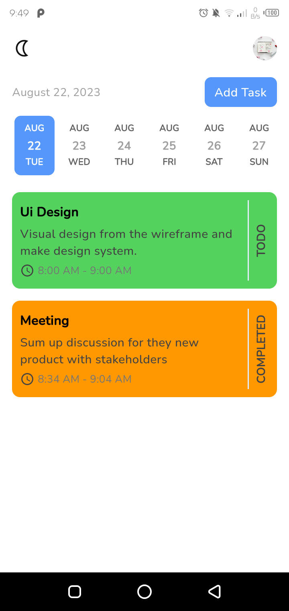
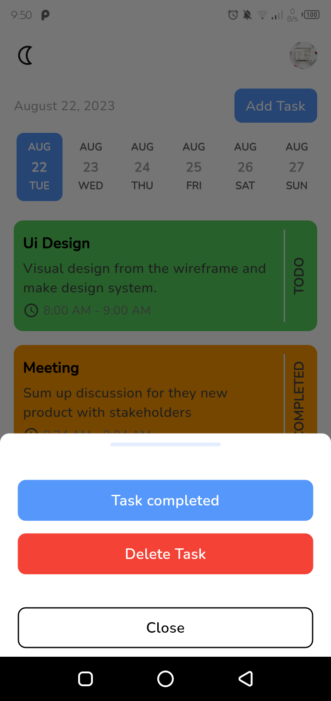
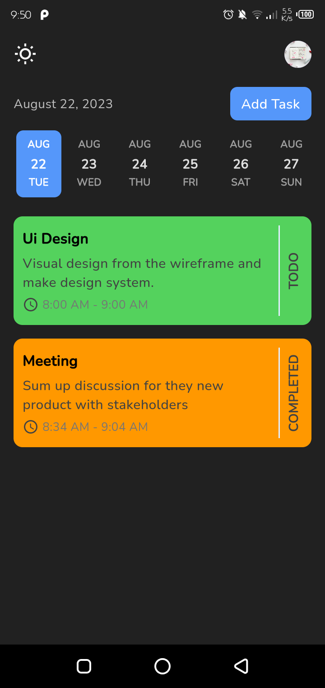
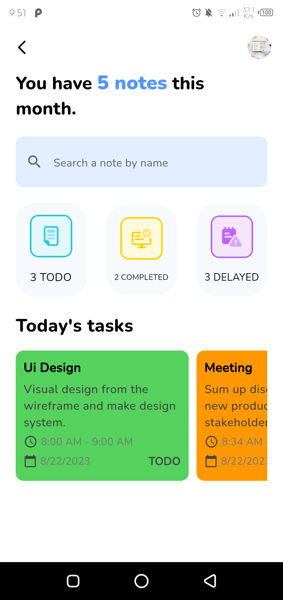

<div style="display:flex; justify-content: center; align-items: center">
  
  
  
  
</div>

<h4>more screenshots in screenshots folder <a href="https://github.com/mhmoudGamea/notify/tree/main/screenshot">  go</a></h4>

> Notify app provide light and dark theme. and you can also search about note by it's name in your profile.

<h6>Local notification</h6>

> I use it to get an alarm before starting time of the note
> Or to have a scheduled notification so you can have an alarm Daily, Weekly or Monthly

> **_NOTE:_**  You want to change notification tone ? simply go to

```shell
android\app\src\main\res\raw\
```
> then put your new notification tone with .mp3 extension. then go to

```shell
lib\core\utils\notification_services.dart
```
> in line 29 mention your notification tone without it's .mp3 extension.

