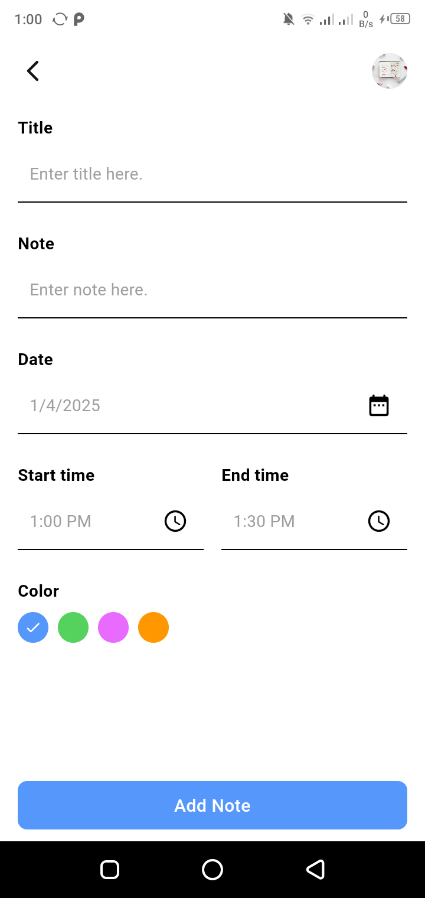

<div style="display:flex; justify-content: center; align-items: center">
  
  
  
  
  
</div>

<h4>more screenshots in screenshots folder <a href="https://github.com/mhmoudGamea/notify/tree/main/screenshot">  go</a></h4>

> Notify app provide light and dark theme. and you can also search about note by it's name in your profile.

<h6>Local notification</h6>

> I use it to get an alarm before starting time of the note by 1 minute

> I'm also using <a href="https://pub.dev/packages/workmanager">workmanager</a></h4> package to make notification every day at 8:00 AM to app users even if the app is closed so the user can open the app and add his new day tasks.

> **_NOTE:_**  You want to change notification tone ? simply go to

```shell
android\app\src\main\res\raw\
```
> then put your new notification tone with .mp3 extension. then go to

```shell
lib\core\utils\notification_services.dart
```
> in line 29 mention your notification tone without it's .mp3 extension.

